# FRED user manual

FRED (Formant Research for EDucation) shows acoustic speech data as plots. You load a CSV
or TSV file of measurements. FRED then plots vowel spaces, trajectories, durations,
distributions, and consonant spectral data. You can export each plot as an image.

FRED operates fully in your browser. It does not send your data to a server. You do not
need an account.

> **You do not have to install FRED.** The program is available at
> <https://snavez.github.io/FRED/>. To run FRED from the source code instead, refer to the
> [README](../README.md).

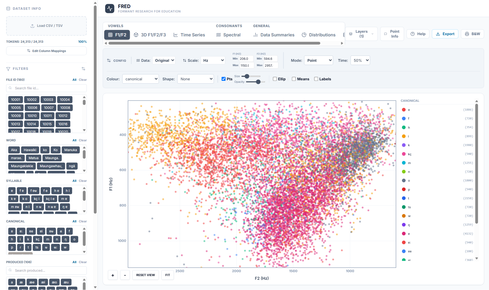

---

## Contents

1. [Input file format](#1-input-file-format)
2. [How to load your data](#2-how-to-load-your-data)
3. [The main window](#3-the-main-window)
4. [How to filter the data](#4-how-to-filter-the-data)
5. [Colours, shapes, and styles](#5-colours-shapes-and-styles)
6. [The plots](#6-the-plots)
   - [F1/F2 vowel space](#f1f2-vowel-space)
   - [Layers](#layers)
   - [3D F1/F2/F3](#3d-f1f2f3)
   - [Time series](#time-series)
   - [Spectral (consonants)](#spectral-consonants)
   - [Data summaries](#data-summaries)
   - [Distributions](#distributions)
   - [Statistics](#statistics)
   - [Table](#table)
7. [How to identify a token](#7-how-to-identify-a-token)
8. [How to export a figure](#8-how-to-export-a-figure)
9. [Troubleshooting](#9-troubleshooting)

---

## 1. Input file format

FRED does not use one fixed column layout. It reads the column names and finds the data
that it can plot. This section gives the limits of what FRED accepts.

**FormantStudio writes files in this format.** If you use
[FormantStudio](https://github.com/snavez/FormantStudio), its formant and spectral output
loads into FRED directly. You do not have to change the file.

### File properties

| Property | What FRED accepts |
|---|---|
| File type | `.csv`, `.tsv`, or `.txt` |
| Separator | A comma or a tab. FRED finds the separator from the first line. **FRED does not accept a semicolon.** |
| First row | The column names. If your file has no names, set **First row** to **Data** in the dialog. |
| Line ends | Windows (CRLF) or Unix (LF) |
| Encoding | UTF-8. A byte-order mark (BOM) is permitted. Accented and macron characters are permitted in names and values. |
| Quotation marks | A value can be in quotation marks. Use quotation marks if the value contains the separator. To show a quotation mark in a value, write it two times. |
| Empty values | Permitted. FRED ignores an empty value or a non-numeric value such as `NA` for that one measurement. It keeps the token. |
| File size | Large files are permitted. A file of 50,000 rows loads in less than one second. |

### Two data layouts

FRED accepts two layouts. It finds the layout automatically.

**Wide layout — one row for each token.** Each measurement point has its own column:

```
speaker,word,vowel,f1_00,f2_00,f1_50,f2_50,f1_100,f2_100
s1,ko,o,520,1150,505,1080,498,1020
```

**Long layout — one row for each measurement point.** One column groups the rows into
tokens, and one column gives the time:

```
token_id,timepoint,f1,f2,vowel
1,0,520,1150,o
1,50,505,1080,o
1,100,498,1020,o
```

For the long layout, set one column to **Token ID** and one column to **Timepoint**. FRED
usually finds these columns. It accepts three time scales and converts each token to
0–100%:

- A fraction from 0 to 1
- A percentage from 0 to 100
- Milliseconds or seconds

### Column names that FRED knows

You can give your columns any name. FRED knows these patterns and sets the column type for
you. You can correct any column in the dialog.

| Data | Example names |
|---|---|
| Formants | `f1_50`, `F2_00_smooth`, `f3_midpoint`, `f1` |
| Pitch | `f0_50`, `pitch` |
| Duration | `duration`, `dur`, `vowel_dur`, `allophone_dur` |
| Speaker | `speaker`, `participant`, `subject` |
| File | `filename`, `file_id`, `file` |
| Token ID (long layout) | `token_id`, `segment_id`, `item_id` |
| Timepoint (long layout) | `timepoint`, `times_norm`, `time_rel` |
| Spectral moments | `COG_50%`, `SD_20`, `skewness_80%`, `kurtosis_50%`, `centroid`, `spread`, `SpecDiff` |
| Band energy ratio | `bandratio_50%`, `band_ratio_release_20%`, `BER_k1` |
| Spectral tracks | `COG_t0` … `COG_t10`, `bandratio_t0` … `bandratio_t10` |
| Spectral coefficients | `COG_k0` … `COG_k3`, `bandratio_k0` … `bandratio_k3` |

Formant columns F1 to F5 are permitted. F1, F2, and F3 go into the vowel plots. F4 and F5
become data fields that you can plot in **Data summaries**.

FRED puts all other columns into two groups. A column with a small number of different
values becomes a filter. A column with many numeric values becomes a data field.

---

## 2. How to load your data

1. Click **Load CSV / TSV** at the top of the sidebar.
2. Select your file. The **Data mapping** dialog opens.
3. Examine each column and its type.
4. Click **Import data**.

FRED does not import the data until you click **Import data**.

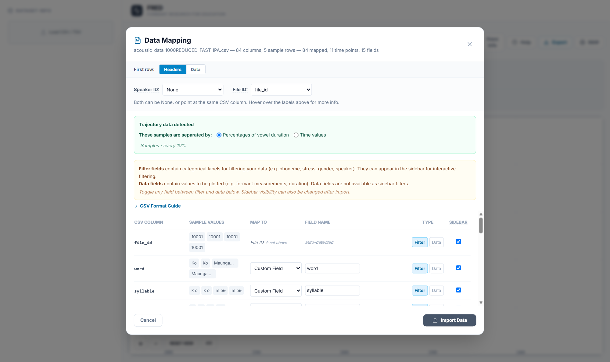

### Column types

Use the **Map to** menu to set the type of a column.

| Type | What it does |
|---|---|
| **Speaker ID / File ID** | Identifies the speaker or the source file. Set these with the menus at the top of the dialog. |
| **Formant value** | A formant measurement. Select F1 to F5 and the timepoint. |
| **Duration value** | The length of the segment. |
| **Pitch value** | An F0 measurement. |
| **Spectral COG / Diffusion (SD) / Skew / Kurtosis / Band Energy Ratio** | A consonant spectral measurement. Refer to [Spectral](#spectral-consonants). |
| **Token ID / Timepoint** | Groups the rows of a long-layout file. |
| **Custom field** | Any other column. |
| **Ignore** | FRED does not read the column. |

### Filter fields and data fields

Each column that you keep is a filter field or a data field.

- A **filter field** holds category names, such as a phoneme or a stress level. You can
  filter the tokens with it.
- A **data field** holds numbers that FRED can plot.

Click **Filter** or **Data** to change the type. The **Sidebar** checkbox controls if the
filter is visible in the sidebar.

### Column groups

FRED puts related columns into one group row. This keeps the dialog short. Formant
trajectories make one group for each formant. Spectral columns make one group for each
measurement type:

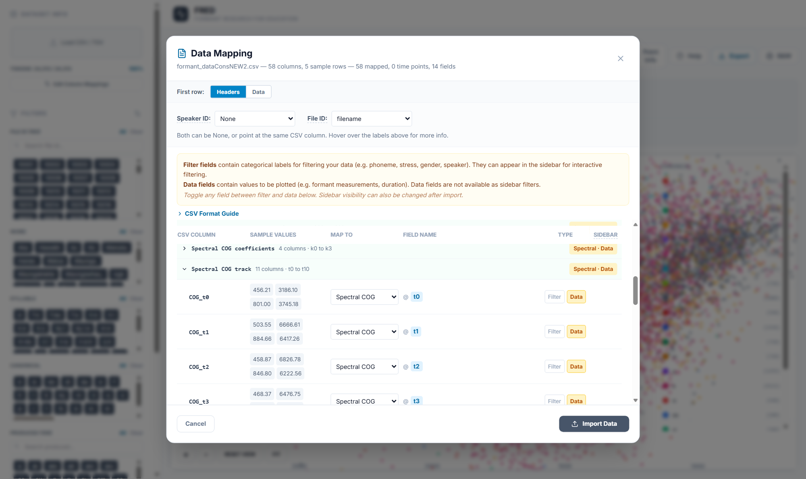

Click a group to open it. Each column in the group shows its position as a small label:
`20%`, `t3`, or `k1`. FRED reads this position from the column name. If a column is in the
wrong group, change its type. The column then leaves the group.

Groups can have any number of columns. FRED counts them in your file.

To change the column types after you import the data, click **Edit column mappings** in
the sidebar.

---

## 3. The main window

- **Sidebar (left)** — data information, the load button, and the filters.
- **Tab bar (top)** — the plots, in three groups:
  - **Vowels** — F1/F2, 3D F1/F2/F3, Time series
  - **Consonants** — Spectral
  - **General** — Data summaries, Distributions, Statistics, Table
  The groups show what each plot is for. All plots stay available with one click. The
  plots in the **General** group accept any numeric field, which includes spectral data.
- **Config bar (below the tabs)** — two rows. The first row has the data controls, such as
  the scale, the plot type, and the axis limits. The second row has the visual controls,
  such as the colour and the element sizes.
- **Buttons (top right)** — **Layers**, **Point info**, **Help**, **Export**, and **B&W**.

Click **Help** to show an explanation when you point to a control.

---

## 4. How to filter the data

Each filter field has a section in the sidebar. Each different value has a button.

- Click a button to select or release that value.
- Click **All** to select all the values.
- Click **Clear** to release all the values.

FRED plots only the tokens that agree with all the filter sections. The counter at the top
of the sidebar shows how many tokens stay.

Click the gear icon adjacent to **Filters** to select which fields are visible.

Each layer has its own filters. The sidebar controls the layer that you selected. Refer to
[Layers](#layers).

---

## 5. Colours, shapes, and styles

The second row of the config bar sets the visual controls. Each control uses one of your
category fields:

- **Colour** — the colour of each point or line.
- **Shape** — the shape of each point. Point plots only.
- **Line type** — the dash pattern of each line. Trajectory plots only.

The legend is at the top right of the plot. It shows each group and its number of tokens.
Click an entry in the legend to open the style editor. You can then set a different colour,
shape, or dash pattern for that group.

Click **B&W** to change the plot to grey shades for printing.

Each element has a checkbox and sliders for its size and opacity. Decrease the opacity of
the points to make the means and the ellipses easier to see.

---

## 6. The plots

### F1/F2 vowel space

This plot shows F2 on the X axis and F1 on the Y axis. Both axes are inverted. The vowels
thus stay in their usual positions.

- **Data** — the initial or the smoothed formant values, if your file has both.
- **Scale** — Hz, Bark, ERB, Mel, Lobanov, or Nearey 1.
- **Min / Max** — the axis limits.
- **Mode: Point** — one marker for each token at the timepoint that you select. You can
  add points, standard-deviation ellipses, group means, and labels.
- **Mode: Trajectory** — the formant path of each token. You can add mean paths with
  arrows, and labels.

Turn the mouse wheel to zoom. Drag to move the plot. Click **Reset view** or **Fit** at the
bottom left.

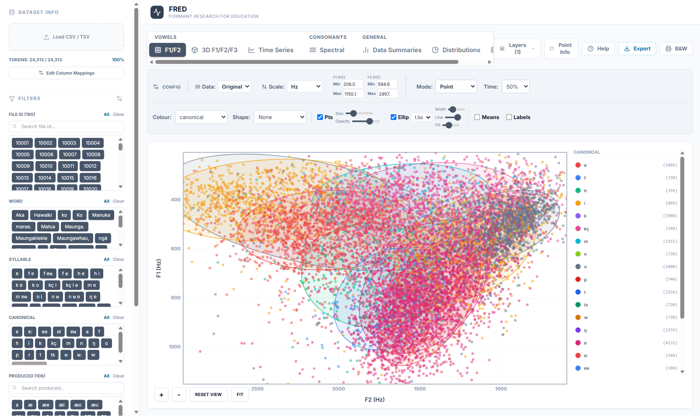

### Layers

A layer is one set of data with its own filters and its own style. Layers let you show more
than one subset on the same axes. For example, you can show two speaker groups, or points
for one phoneme class and paths for a different class.

Click **Layers** at the top right to open the layer panel.

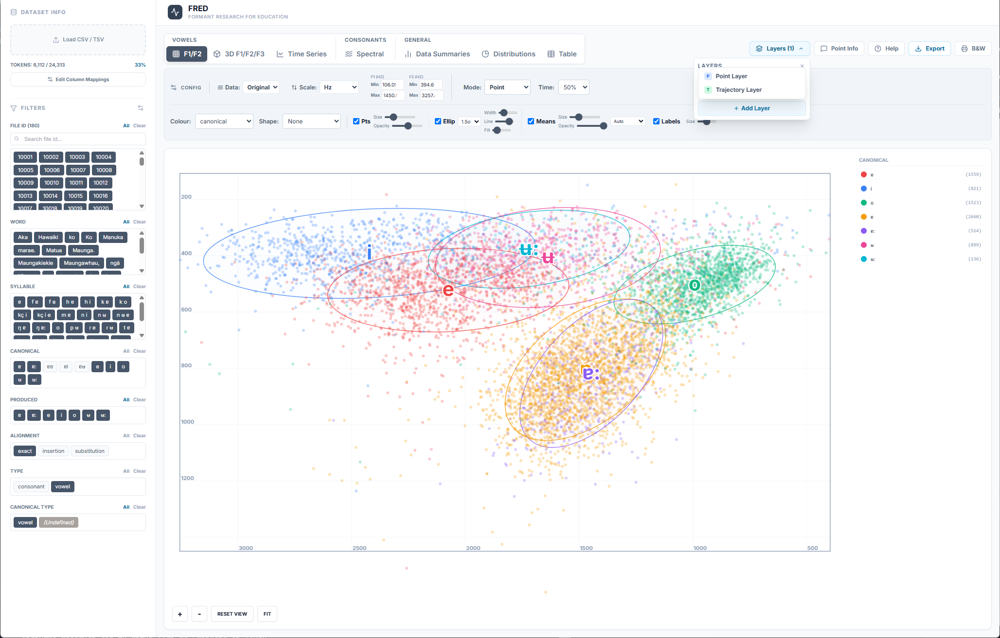

- Click **Add layer**. Then select **Point** or **Trajectory**.
- Click a layer to select it. The sidebar filters and the config controls then apply to
  that layer.
- Double-click the name of a layer to change it.
- Click the eye icon to hide or show a layer.
- Click the arrows to change the order of the layers.

The **Background** layer controls the axes for all layers.

Layers are available on the F1/F2 plot and on the Spectral scatter plot.

### 3D F1/F2/F3

This plot adds F3 as a third axis. Drag to turn the plot. Turn the mouse wheel to zoom. The
colour, the shape, and the timepoint controls operate as on the F1/F2 plot.

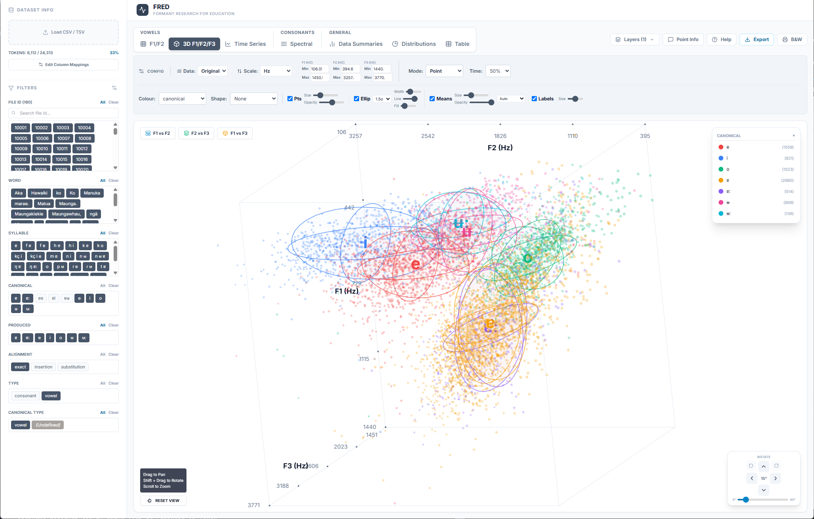

### Time series

This plot shows formant values against time. It draws one line for each token. You can add
a mean line for each group.

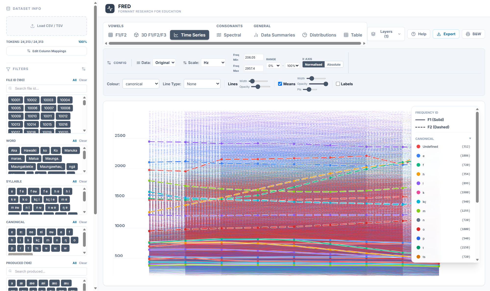

- **X-axis: Normalised** shows 0–100% of each segment. **X-axis: Absolute** shows
  milliseconds and uses the duration of each token.
- **Freq Min / Max** sets the Y-axis limits.
- **Range** shows only a part of the trajectory.

### Spectral (consonants)

This plot shows consonant data. It uses the four spectral moments, and the band energy
ratio:

| Measure | What it shows |
|---|---|
| **COG** (centre of gravity, Hz) | Where the energy of the spectrum is. Sibilants have a high COG, near 6–8 kHz. Other fricatives have a lower COG. |
| **SD** (diffusion or spread, Hz) | How wide the spectrum is. [s] is compact. [f] and [h] are wide. |
| **Skewness** | The tilt of the spectrum. A positive value shows more energy below the mean. |
| **Kurtosis** | How sharp the spectral peaks are. A high value shows clear peaks. |
| **Band energy ratio** (dB) | How much more energy is in a high frequency band than in a low one. 0 dB is equal energy in both. FRED draws 0 dB as a line across the plot. |

Your file can give each measure in three forms. FRED uses the forms that your file has:

- **Moments** — one value at each position, such as `COG_20%`, `COG_50%`, and `COG_80%`.
- **Track** — many values across the segment, such as `COG_t0` to `COG_t10`. This is the
  contour of the measurement. A track can have any number of samples. The track of the
  band energy ratio is often the most useful view of it: an aspirated release and a
  fricated one differ in how the ratio moves across the release, not only in its mean.
- **Coefficients** — values that give the shape of that contour, such as `COG_k0` to
  `COG_k3`. **k0** is the height of the contour. **k1** is its slope. **k2** is its
  curvature. A file can have any number of coefficients.

#### Which bands the ratio compares

Two files can both have a column named `bandratio_50%` and mean different things, because
the bands were set differently when they were exported. The numbers are then not
comparable, and nothing in the column name says so.

FormantStudio writes the band edges into a JSON file beside the CSV, named
`<your-file>.provenance.json`. Select **both** files together in the **Load CSV / TSV**
picker. FRED then names the bands on every axis that shows the ratio — for example
`Band ratio 5.5–7.5k / 0.4–0.9k (dB)` — and lists them under **Dataset info**. Without
that file the axis reads simply `Band Energy Ratio (dB)`; FRED never guesses the edges.

Read the config bar from left to right:

1. **Plot** — one of the four plots below.
2. **Mode** — the variant of that plot.
3. **Data** — one of the three forms above.
4. **Axes** — the measurement on each axis, and the position in it.
5. **Min / Max** — the axis limits.

The two axes always use the same form. You thus cannot compare a track sample with a
moment by mistake. If you select **Moments**, the axes show only moments. One **Time** menu
(or **Sample** menu) moves both axes together, as on the formant plots.

#### Mean contours

Start with this plot. It calculates the mean contour of each group and draws one line for
each group. It also draws a band of ±1 standard deviation.

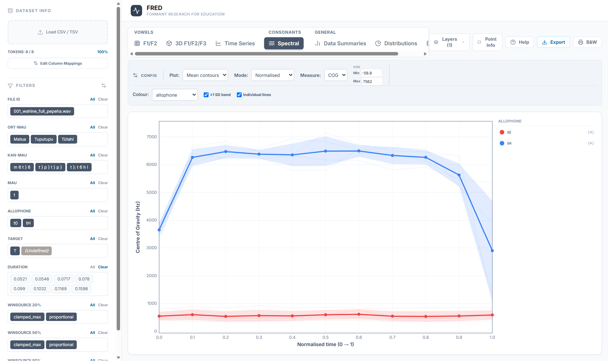

All tokens use the same grid. FRED can thus calculate a mean at each point of the grid.
Set **Colour** to the category that you want to compare, such as the subsequent vowel.
Select **Individual lines** to also show the tokens behind each mean.

Normalised time hides the duration. Two groups fill the same axis, even if one group is
30 ms long and the other group is 120 ms long. Set **Mode** to **Absolute (ms)** to use
the real duration of each token:

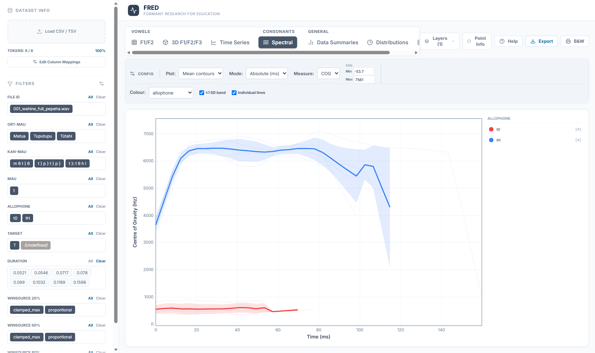

In this example, the closures stop near 70 ms. The aspirated releases continue after
110 ms. The normalised view does not show this difference. In absolute mode the tokens do
not share a grid. FRED thus draws each mean only where sufficient tokens continue. Short
tokens leave the mean at the end instead of a decrease of the mean.

> **Note.** The track starts and stops one half of an analysis window inside the segment.
> Thus `t0` is not exactly the start of the segment. This is satisfactory for comparison,
> but do not give too much weight to the end values. To remove an unreliable end value, use
> the **Range** control in Trajectory mode.

#### Distribution

This plot shows a box plot or a violin plot of one measurement for each group.

Select a coefficient to compare the shape of the contours. A box plot of **k1** compares
the direction and the steepness of the contours as a number.

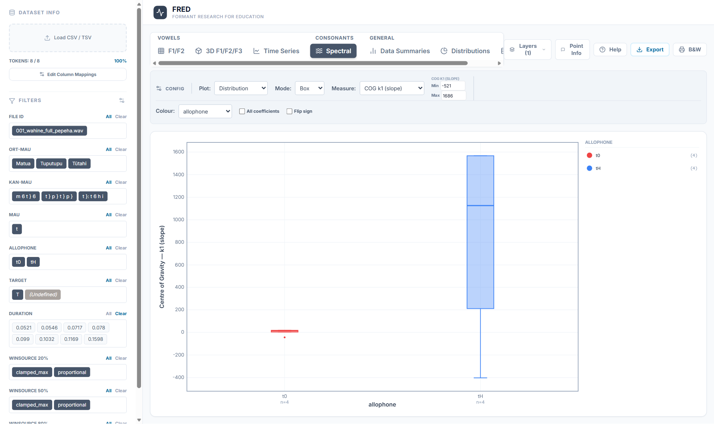

A contour that increases has a negative k1. Thus a **Flip sign** checkbox becomes available
when you select a coefficient. Select it to make a larger value show an increase.

To compare the coefficients with each other, select **All coefficients**. FRED then draws
one small plot for each coefficient:

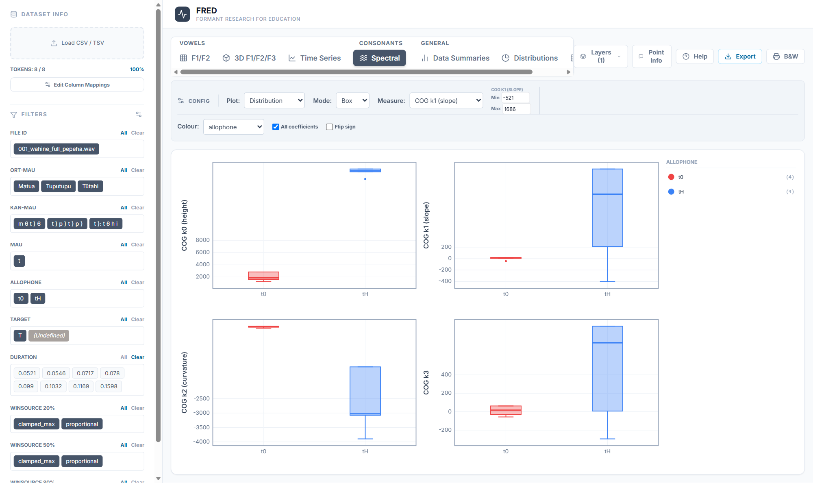

Each small plot has its own scale. This is necessary because k0 can be more than 10,000
while k1 is only some hundreds. One scale would make all the plots except k0 too small to
read.

> **Note on the number of tokens.** A violin plot and a density plot show a smooth curve
> through your data. If a group has only a small number of tokens, the shape of that curve
> comes from the calculation and not from the speech. Use approximately 20 tokens or more
> in each group. A box plot and a mean are more reliable with a small number of tokens.

#### Scatter

This plot shows one measurement against a different measurement. It accepts layers. Two
combinations are of special use:

- **COG × SD** separates sibilants from other fricatives. In this example it separates the
  closures (t0, low COG) from the aspirated releases (tH):

  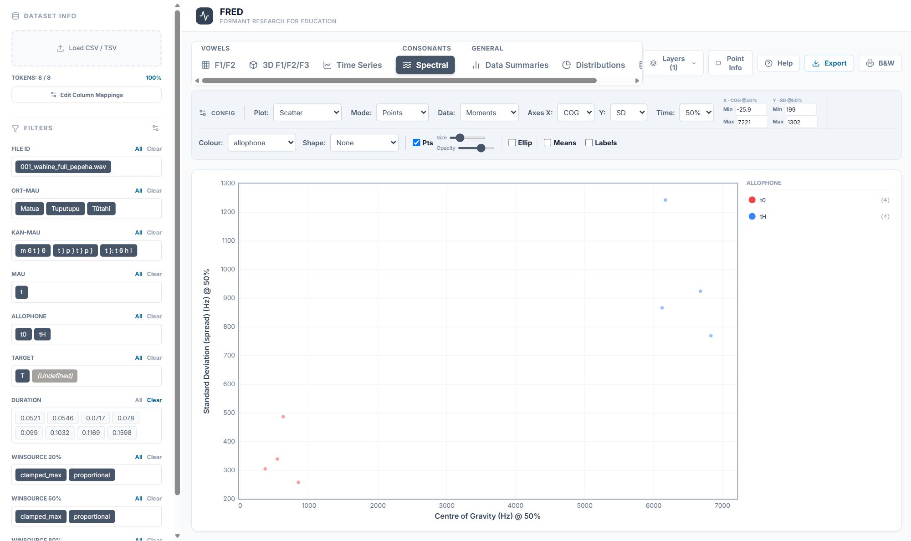

- **k0 × k1** (height against slope) shows the shape of the contour as two values. Set
  **Data** to **Coefficients**. Each axis then has its own coefficient menu. Categories
  that have the same height frequently become separate when you add the slope:

  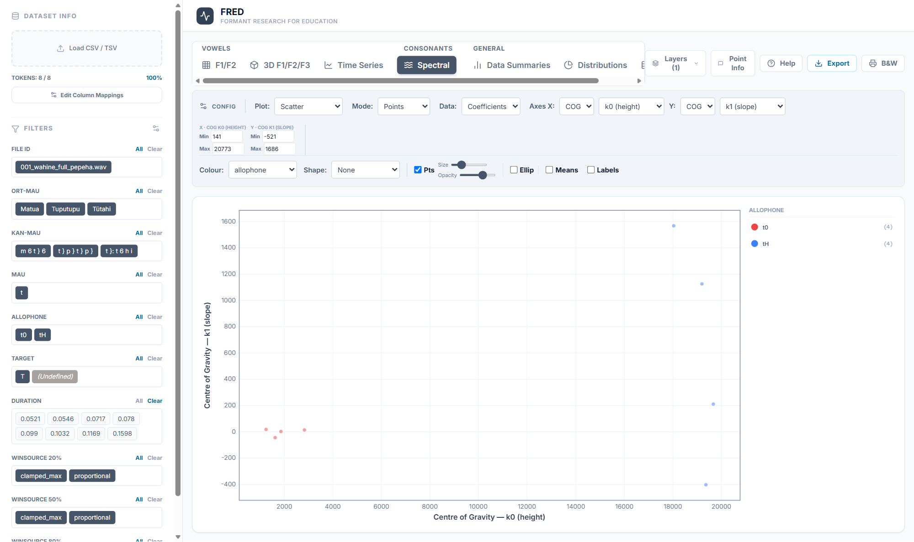

Set **Mode** to **Trajectory** to draw the path of each token through the axes across time.
The path uses the data form that you selected. Mean paths show an arrow at the end. The
**Range** control removes samples from the start or the end of the path.

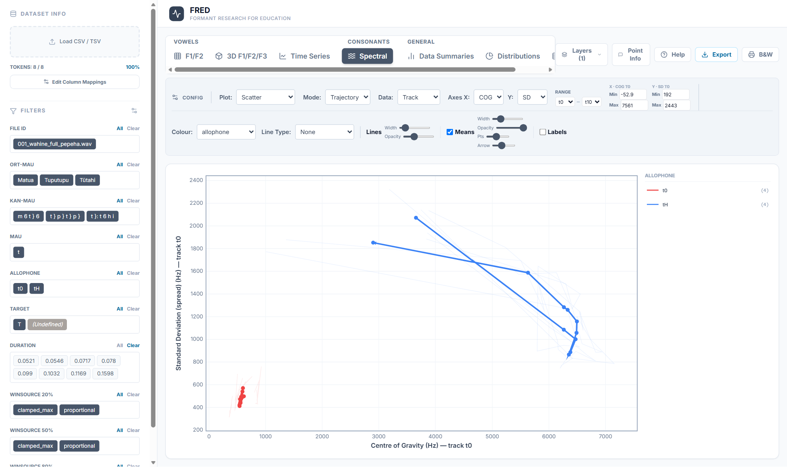

**An example procedure:**

1. Show the means of the fricatives as a Point layer. Add ellipses.
2. Click **Add layer** and select **Trajectory**.
3. Filter the new layer to the stop releases.
4. Examine where the releases move in relation to the fricative groups.

A coefficient gives the shape of a full contour. Thus it has no time axis. **Coefficients**
is not available in the **Data** menu when **Mode** is **Trajectory**.

#### Density

This plot shows a smooth curve of one measurement for each group. All the curves use the
same axis.

Read two things from this plot. First, find the position of the peak of each group. Second,
examine how much the curves cover each other. Curves that cover each other show that this
measurement does not separate your categories. Curves that stay separate show that it does.

**COG** and **k1** give the most information. Skewness and kurtosis are less reliable.
Tracks are not available here, because a track is a full contour and not one value. The
note on the number of tokens above also applies to this plot.

### Data summaries

This plot shows a box plot of the duration, or of any other numeric field. This includes
the formants, the spectral measurements, and your own data fields. Select a category field
to make the groups.

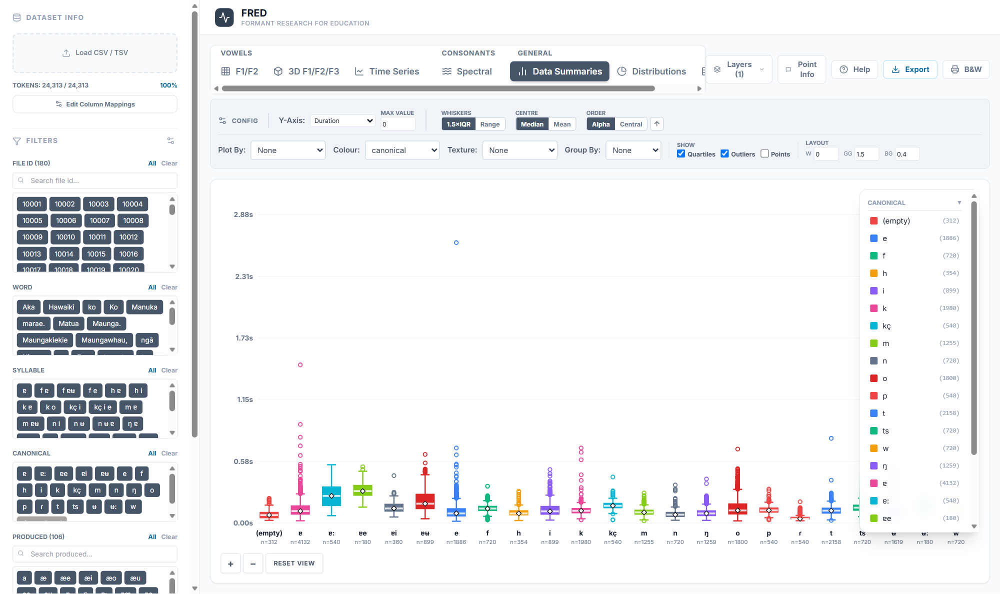

You can set the whiskers (1.5 × IQR or the full range), the centre line (the median or the
mean), and the order of the boxes. Tick **Values** to print the centre number beside each
box; it always shows whichever statistic the centre line is set to. The same tick box is
on the **Spectral → Distribution** plot.

Use this plot together with **Mean contours**. Normalised contours do not show the
duration, but this plot does.

### Distributions

This tab has two modes.

**Distribution** shows a histogram of a numeric field. Set **Colour** to compare groups on
one axis. In this example, the durations of a short vowel and a long vowel are overlaid:

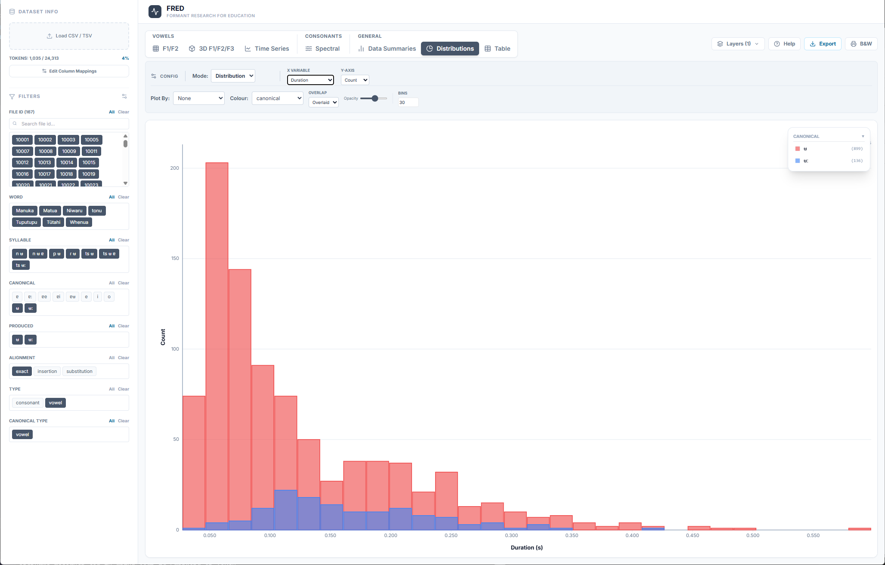

The **Overlap** control sets how the groups combine (overlaid, stacked, or side by side),
and **Bins** sets the number of bars.

**Counts** shows the number of tokens in each category. Four controls set the chart
structure:

- **Plot By** — one small chart for each value of a field.
- **Group By** — clusters of bars inside one chart.
- **Colour** and **Texture By** — the bars in each cluster.

In this example, each diphthong has its own chart. In each chart, one coloured bar shows
the percentage of that diphthong's tokens that have a given syllable mark (0, 1, or 2):

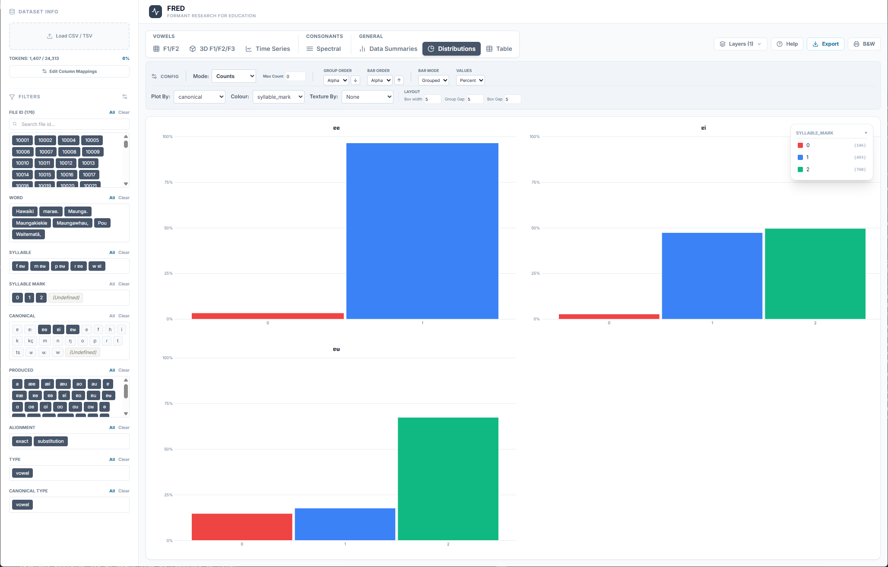

The **Layout** boxes set the geometry: **Bar width** (0 = automatic), **Group gap**
(the space between the Group By clusters — it operates only when Group By is set), and
**Bar gap** (the space between bars inside a cluster). The **Values** control changes
between counts and percentages.

### Statistics

This tab runs statistical tests on the filtered data. The filters in the sidebar apply
here exactly as they apply to the plots — what you removed from a plot is also removed
from the tests.

Two analysis types are available.

**Continuous** compares a numeric measure between groups:

1. Select one or more **Measures** (duration, formants, spectral measures, or your own
   numeric fields).
2. Select **Factor A** — the grouping to compare.
3. Optionally select **Factor B** for a two-way factorial design with an interaction.

**Speakers and the unit of analysis.** Tokens from one speaker are correlated — a
speaker's vowels share their voice, dialect, and speech rate. If FRED counted 50 tokens
from each of 20 speakers as 1,000 independent observations, the p-values would be far
too small. When your data has a speaker column, FRED examines the design and reports it
in a banner above the results:

- **Unit: Speaker means** (the default) uses one mean per speaker per group.
- If each speaker is in one group only (a between-speaker factor, such as dialect),
  FRED compares the speaker means with the independent tests.
- If the factor varies within speakers (such as vowel or stress), FRED uses the paired
  and repeated-measures tests on the speakers that have data in every level.
- **Unit: Tokens** uses every token. FRED permits this but shows a warning, because the
  results can overstate significance.

If the data has no speaker column, a **Speakers** control lets you record what you know
(one speaker / several speakers / unknown), and the banner explains the consequences.

FRED then examines the distributions: a Shapiro-Wilk normality test (per group for
independent designs; on the paired differences or model residuals for repeated designs)
and Levene's test for equal variances. With **Test** set to **Automatic**, FRED selects
the correct test from these checks and tells you why:

- Two independent groups — Student's t-test, Welch's t-test, or Mann-Whitney U.
- Three or more independent groups — one-way ANOVA, Welch's ANOVA, or Kruskal-Wallis.
- Two conditions within speakers — paired t-test or Wilcoxon signed-rank.
- Three or more conditions within speakers — repeated-measures ANOVA (with
  Greenhouse-Geisser correction) or the Friedman test.
- Two factors — factorial ANOVA with the interaction, simple effects when the
  interaction is significant. With Unit: Speaker means, the factorial ANOVA runs on one
  mean per speaker per cell.

You can also select a test yourself. FRED runs your choice, but shows a warning when the
assumption checks recommend a different test. Significant omnibus tests get post-hoc
pairwise comparisons (Tukey HSD, Dunn's test, or paired comparisons — with Bonferroni
correction where applicable), and every result reports an effect size with its magnitude
(Cohen's d or dz, η², partial η², Kendall's W, rank-biserial r). The α threshold is
adjustable.

**Mixed-effects model.** When the data has a speaker column and repeated tokens, the
**Test** menu offers **Mixed-effects model (random intercepts)**. This model uses every
token. It does not aggregate. It fits a random intercept for each speaker, and also for
each word when the data has a word column. The intercepts absorb the correlation between
the tokens of one speaker. This is the standard model in phonetic research.

For each measure, FRED reports:

- The model formula, for example `F1 ~ vowel + (1|speaker)`.
- A likelihood-ratio test for the factor. This is the headline p-value. It compares the
  model with the factor against the model without it.
- The fixed effects: the estimate, the standard error, and *t* for each level against
  the first level. A mixed model has no exact degrees of freedom for *t*. Use the
  likelihood-ratio test for the factor, and |*t*| > 2 as a rough guide for one level.
- The variance components: how much variation the speakers (and the words) cause, and
  how much remains between tokens.

FRED fits random intercepts only. For random slopes and larger models, use the export
that follows.

**Export for R.** The **Export for R (lme4)** button is on the design banner. It
downloads two files:

- `fred_data.csv` — the filtered data with your measures, factors, speaker, and word.
- `fred_analysis.R` — a complete lme4 / lmerTest script. The script fits the same
  models, runs the likelihood-ratio tests, and contains commented lines for random
  slopes and pairwise comparisons.

Put the two files in one folder. Then run the script in R or RStudio.

**Categorical** cross-tabulates two category fields and tests their association with a
chi-square test of independence (or Fisher's exact test for small 2×2 tables), with
standardized residuals to show which cells drive the association.

Every table has **Copy / LaTeX / CSV** buttons for direct use in a manuscript.

> **Note.** Speaker means control for the speaker, but not for other grouping structure
> such as the word. The mixed-effects model controls for both when the data has a word
> column. When you must report random slopes, use the R export.

### Table

This view shows the tokens that agree with the filters. Use it to examine the data that
FRED plots. Click a column name to sort the table. The **Summary** mode gives per-group
descriptive statistics for any measure.

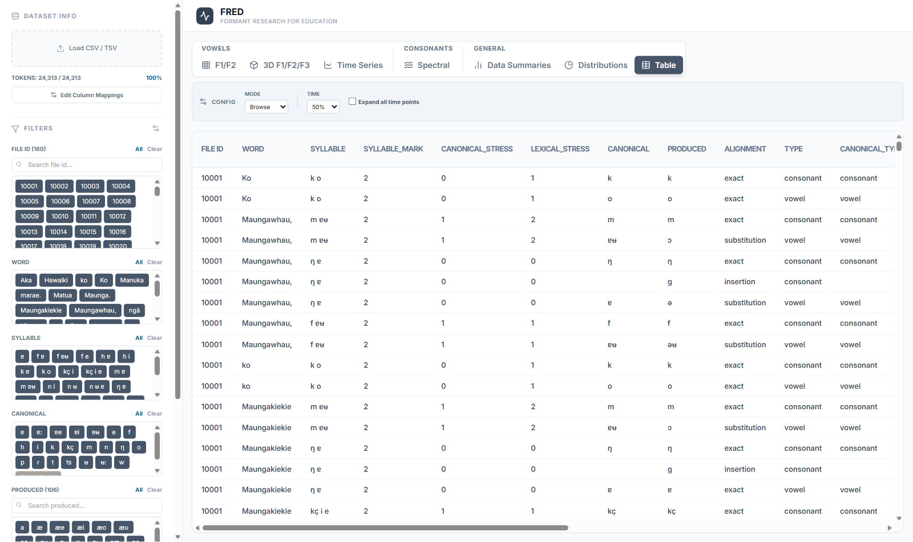

---

## 7. How to identify a token

Point to a marker to show a tooltip. The tooltip identifies the token and gives its
measurements. This operates on the F1/F2, 3D, Spectral, and Data summaries plots.

Click **Point info** at the top right to select the fields in the tooltip. You can select a
maximum of 10 fields.

---

## 8. How to export a figure

1. Click **Export** at the top right. The export dialog opens and shows a preview.
2. Set the controls.
3. Click **Download image**. FRED saves a PNG file.

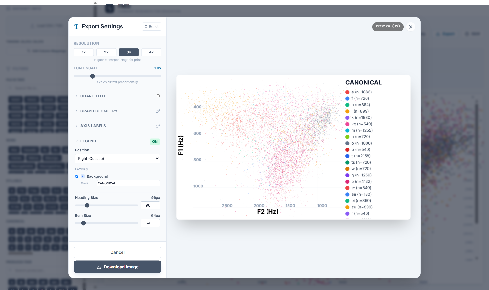

- **Resolution** — 1× to 4×. Use a high value for printing.
- **Font scale**, **chart title**, **graph geometry**, and **axis label** controls.
- **Axis labels → tick numbers** — one size for all tick text, then a size for each of
  **X axis ticks**, **Y axis ticks**, and **X group labels**. Use the last one when the x
  axis is labelled in two rows: the category under each box or bar, and the group name
  beneath it. Each starts at the size the plot already used, so you only change what you
  need to.
- **Legend** — the position, the layers to include, and the text sizes.

For a black-and-white publication, click **B&W** before you export. FRED then uses grey
shades. Also set **Shape** or **Line type** to keep the groups different.

---

## 9. Troubleshooting

| Condition | Cause and correction |
|---|---|
| The plot is empty after you import a file | A filter section has no selected values. Click **All** in that section. Examine the token counter in the sidebar. |
| The columns are in the wrong order or in one column | The file uses a semicolon separator. FRED accepts only a comma or a tab. Save the file again with one of these. |
| The first row of data is missing | FRED used the first row as the column names. Set **First row** to **Data** in the dialog. |
| There are no colours and no legend | **Colour** is set to **None**. Select a field. |
| The message "No spectral columns detected" is shown | No column has a spectral type. Click **Edit column mappings**. Set **Map to** to **Spectral COG**, or to a different spectral type. |
| A measurement is not in the **Mean contours** menu | That moment has only one measurement point. A contour needs a track or more than one timepoint. |
| A Trajectory layer shows points and not paths | One axis uses a coefficient. Set **Data** to **Moments** or to **Track**. |
| The k1 box plot appears to be inverted | A contour that increases has a negative k1. Select **Flip sign**. |
| A numeric column has many filter buttons | The column is a filter field. Change it to **Data** in the dialog. |
| A column is in the wrong trajectory group | Open the group in the dialog. Change the type of that column. It then leaves the group. |
| A long-layout file gives one token for each row | Set one column to **Token ID** and one column to **Timepoint**. |
| The data is not visible after you change an axis limit | Set **Min** and **Max** to 0 to return to the automatic limits. On the F1/F2 plot, click **Fit**. |
| The plot is too full | Decrease the opacity of the points. Use the filters to show fewer categories. Put the subsets in different layers. |

---

*The example plots in this manual use two data sets: a wide-layout file of vowel
trajectories, and a consonant file with spectral moments, tracks, and coefficients. To make
the images again, run `node scripts/generate-screenshots.mjs`. The comments at the start of
that file give the necessary conditions.*
